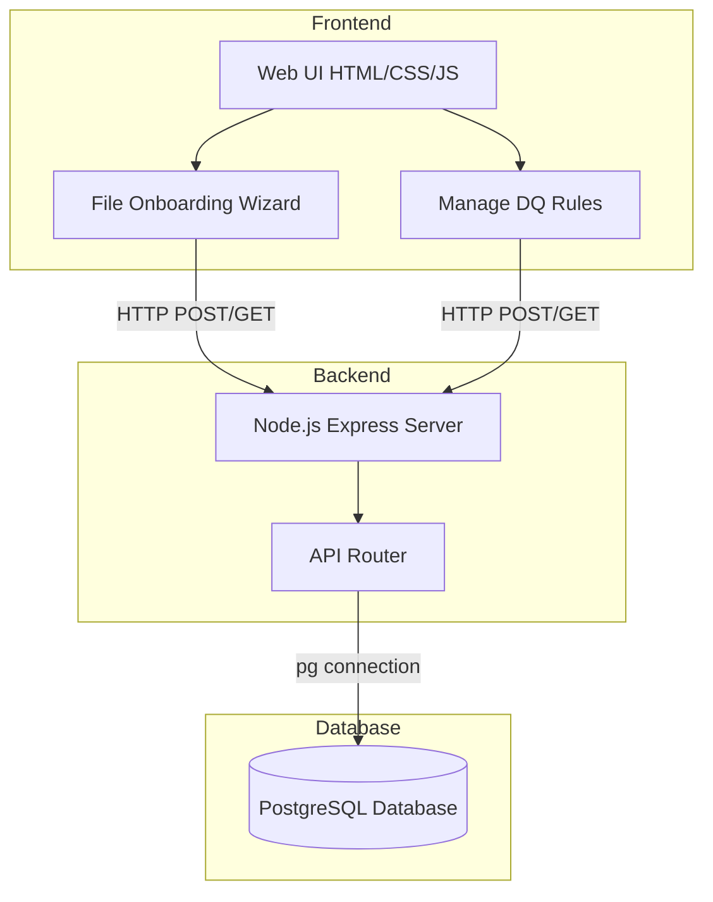
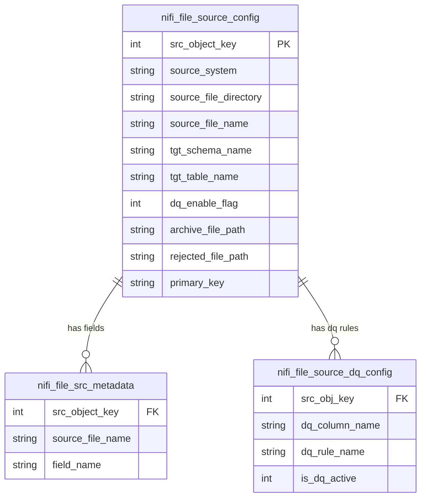
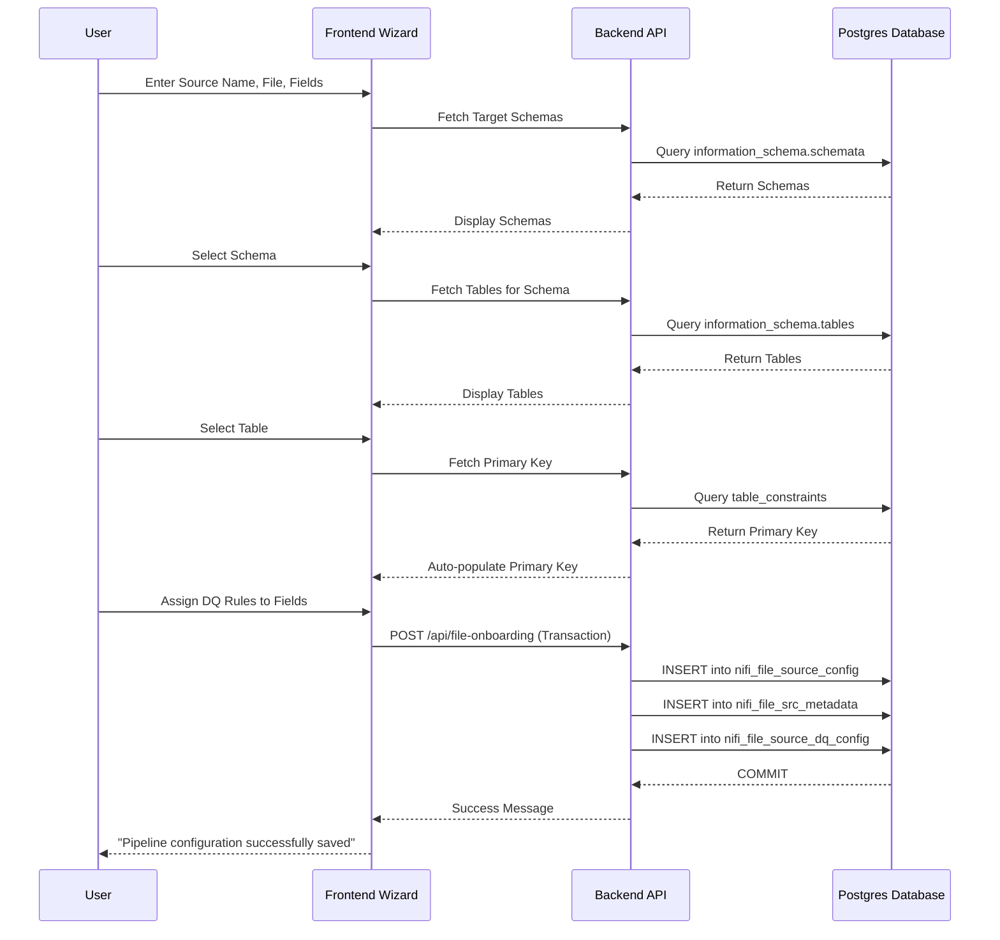
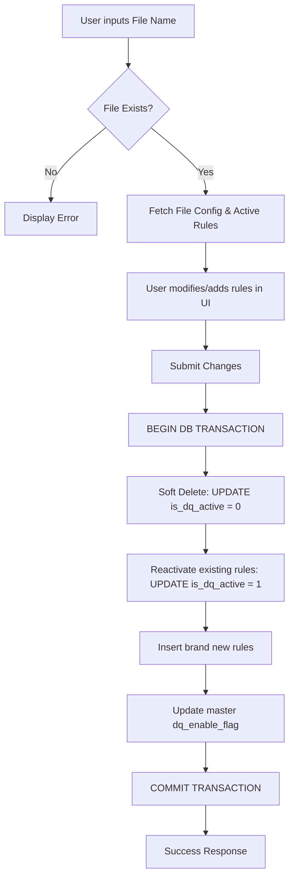

# Data Engineering Portal

Welcome to the **Data Engineering Portal**! This platform provides a centralized, user-friendly interface for managing data pipelines, ingestion processes, and data quality (DQ) validations.

## 🌟 Overview

The Data Engineering Portal allows data engineers and administrators to easily onboard new data sources (such as files or Kafka streams) and define strict data quality rules before data is ingested into target PostgreSQL tables. The portal is built with a Node.js Express backend and a responsive Vanilla HTML/CSS/JS frontend, communicating with a PostgreSQL database to store configuration and metadata.

---

## 🚀 Features

- **Source Onboarding**: Configure new file-based ingestion pipelines with a guided step-by-step wizard.
- **Dynamic Schema Discovery**: Automatically fetches and displays available PostgreSQL schemas, tables, and primary keys.
- **Data Quality (DQ) Rule Mapping**: Assign specific data quality checks (e.g., Null Check, Unique Check) to individual columns.
- **Manage Existing DQ Rules**: Search for existing pipeline configurations and toggle or modify their active Data Quality rules seamlessly with soft-delete capabilities.

---

## 🏗️ Architecture

The application follows a standard three-tier architecture:



---

## 🗄️ Database Entity-Relationship (ER) Diagram

The system stores pipeline metadata and data quality configurations across several relational tables:



---

## 🔄 Core Workflows

### 1. File Source Onboarding Process

The onboarding wizard guides users through configuring a new data pipeline:



### 2. Managing Data Quality (DQ) Rules

Engineers can update rules for existing pipelines safely using a soft-delete mechanism:



---

## 🛠️ Technology Stack

- **Frontend**: Vanilla HTML5, CSS3, JavaScript (Fetch API).
- **Backend**: Node.js, Express.js.
- **Database**: PostgreSQL (pg module).
- **Environment**: dotenv for environment variable management.
- **Middleware**: CORS for cross-origin resource sharing.

---

## 💻 Getting Started

### Prerequisites

- Node.js (v14 or higher)
- PostgreSQL Database

### Installation

1. **Clone the repository:**

   ```bash
   git clone <repository-url>
   cd onboarding_form
   ```

2. **Install dependencies:**

   ```bash
   npm install
   ```

3. **Configure Environment Variables:**
   Create a `.env` file in the `backend/` directory with your database credentials:

   ```env
   DB_USER=your_postgres_user
   DB_HOST=localhost
   DB_DATABASE=your_database_name
   DB_PASSWORD=your_postgres_password
   DB_PORT=5432
   PORT=5000
   ```

4. **Run the application:**
   For development (uses nodemon):

   ```bash
   npm run dev
   ```

   For production:

   ```bash
   npm start
   ```

5. **Access the Portal:**
   Open your browser and navigate to `http://localhost:5000`

---

## 📄 License

This project is licensed under the MIT License. See the [LICENSE](LICENSE) file for details.
