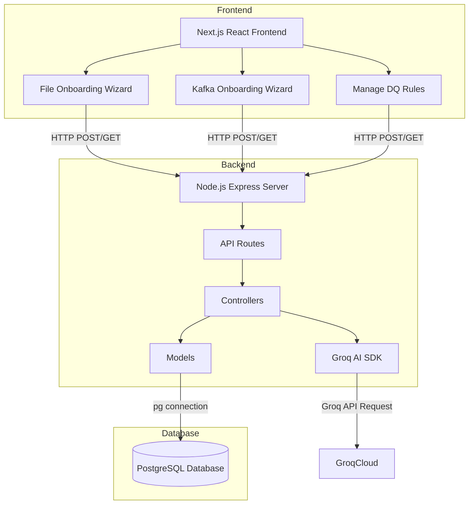
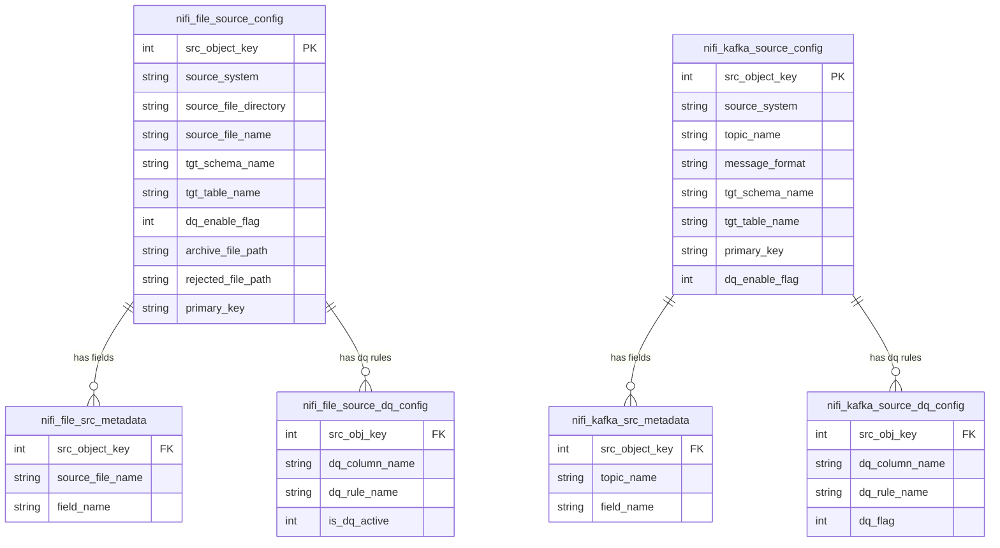
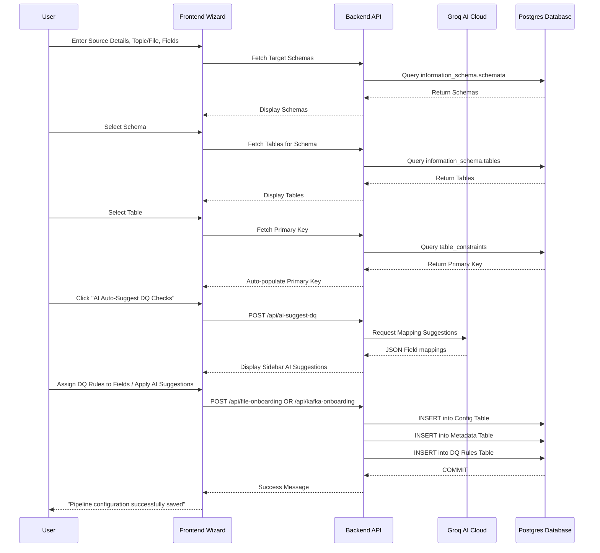
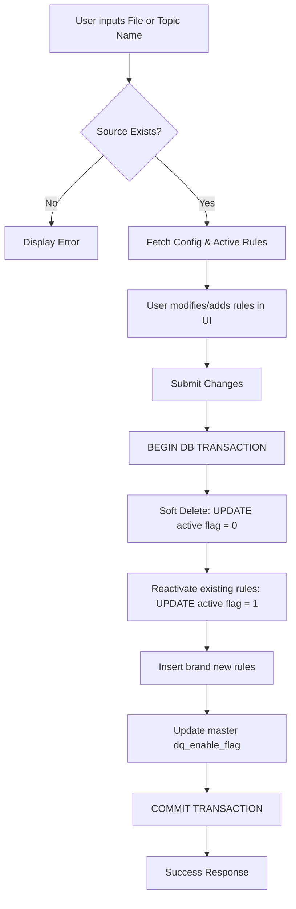

# Data Engineering Portal

Welcome to the **Data Engineering Portal**! This platform provides a centralized, user-friendly interface for managing data pipelines, ingestion processes, and data quality (DQ) validations.

## 🌟 Overview

The Data Engineering Portal allows data engineers and administrators to easily onboard new data sources (such as batch files or real-time Kafka streams) and define strict data quality rules before data is ingested into target PostgreSQL tables. The portal is built with a Node.js Express backend and a responsive Next.js (React) frontend styled with Tailwind CSS v4, communicating with a PostgreSQL database to store configuration and metadata.

---

## 🚀 Features

- **Source Onboarding**: Configure new file-based batch pipelines or Kafka streaming topics using a guided step-by-step wizard.
- **✨ AI Auto-Suggest DQ Checks**: Leverage the power of LLMs (via Groq API) to automatically scan incoming source fields and instantly suggest and apply the most appropriate Data Quality rules.
- **Remote SFTP File Browser**: Seamlessly browse remote SFTP servers with a beautiful UI to pick files for onboarding without manually typing paths.
- **Kafka Schema Auto-Discovery**: Automatically connects to your Kafka brokers to fetch a sample message and intelligently parse out all the JSON keys to use as pipeline fields.
- **Dynamic Schema Discovery**: Automatically fetches and displays available PostgreSQL schemas, tables, and primary keys.
- **Data Quality (DQ) Rule Mapping**: Assign specific data quality checks (e.g., Null Check, Unique Check) to individual columns for both files and Kafka topics.
- **Manage Existing DQ Rules**: Search for existing file or Kafka pipeline configurations and toggle or modify their active Data Quality rules seamlessly with soft-delete capabilities.
- **Premium UI/UX**: Enjoy a fully responsive, visually stunning interface designed with modern web aesthetics, interactive sidebars, and slick micro-animations.

---

## 🏗️ Architecture

The application follows a standard three-tier architecture, utilizing the MVC pattern on the backend:



---

## 🗄️ Database Entity-Relationship (ER) Diagram

The system stores pipeline metadata and data quality configurations across several relational tables for both Files and Kafka:



---

## 🔄 Core Workflows

### 1. Source Onboarding Process (File & Kafka)

The onboarding wizards guide users through configuring a new data pipeline (either File or Kafka):



### 2. Managing Data Quality (DQ) Rules

Engineers can update rules for existing File or Kafka pipelines safely using a soft-delete mechanism:



---

## 🛠️ Technology Stack

- **Frontend**: Next.js (React), Tailwind CSS v4, Framer Motion, Lucide Icons.
- **Backend**: Node.js, Express.js (MVC Architecture).
- **Database**: PostgreSQL (pg module).
- **AI/LLM**: Groq SDK (llama-3.1-8b-instant model)
- **Environment**: dotenv for environment variable management.
- **Middleware**: CORS for cross-origin resource sharing.

---

## 💻 Getting Started

### Prerequisites

- Node.js (v14 or higher)
- PostgreSQL Database
- Groq API Key (for AI features)

### Installation

1. **Clone the repository:**

   ```bash
   git clone <repository-url>
   cd onboarding_form
   ```

2. **Install dependencies:**

   ```bash
   npm install
   ```

3. **Configure Environment Variables:**
   Copy the example environment file in the backend directory and configure it with your database and AI credentials:

   ```bash
   cp backend/.env.example backend/.env
   ```
   *Edit `backend/.env` with your actual Postgres details and your `GROQ_API_KEY`.*

4. **Run the backend:**
   Open a terminal in the `backend` folder and start the API server:

   ```bash
   cd backend
   npm run dev
   ```

5. **Run the frontend:**
   Open a new terminal in the `frontend` folder and start the Next.js development server:

   ```bash
   cd frontend
   npm run dev
   ```

6. **Access the Portal:**
   Open your browser and navigate to `http://localhost:3000`

---

## 📄 License

This project is licensed under the MIT License. See the [LICENSE](LICENSE) file for details.
